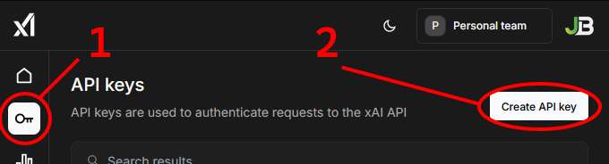

# GrokTutorScript
A Desktop Interface for xAI Grok Queries. Get help from Grok as an online tutor for exam study &amp; prep on any topic, or use for general queries. Create queries from on-screen text using Optical Character Recognition.

This tool is intended to be a quick-and-dirty open-source alternative to existing products like AnswersAI, CollegeTools, TutorUp, SmartSolve, and others. They are fundamentally just API wrappers, and most of them cost upwards of $10 USD per month, which is far more than the credits would cost if purchased directly. The goal is to make AI-tutoring and mentoring tools more financially accessible to students.

# Requirements
Install required Python libraries using the following command;
```pip install pytesseract pillow tkinter requests```
or install from requirements.txt.

You will also need to download and install Tesseract for Optical Character Recognition (OCR) to work. It should work with any version, but the latest is recommended.

Tesseract can be downloaded here: https://github.com/tesseract-ocr/tesseract/releases. You may install Tesseract anywhere you'd like, but you will need to point GrokTutorScript to ```tesseract.exe```.

Tessaract's default install location is: ```C:\Program Files\Tesseract-OCR\tesseract.exe```

# API Key Setup
**To use this tool, you must provide a valid xAI API key.**

Login and purchase API credits from https://console.x.ai/

To create an API key click the key symbol on the left side of the screen, then the "Create API Key" button, as seen below;


Enter a name (it doesn't matter) and press save. You will be shown a text output containing your API Key, but we don't need the whole command.

The part you want to copy is on the very first line, in the **"Authorization: Bearer"** field;
```
... "Content-Type: application/json" -H "Authorization: Bearer [API KEY HERE, COPY THIS]" -d '{ ...
```

Run GrokTutorScript.py, and click Settings. Paste your API Key into the textbox and click Save. You are done setting up the script.

# Using the Script
Simply click the **"New Question"** button, and an overlay will pop up which will allow you to drag a box around the text on your screen you wish to capture.

You may also type directly into the "Question" text box to modify the OCR result, or send a direct prompt.

The "Instructions" text box contains the system prompt, which instructs Grok on "how" it should answer any prompts provided to it. If you want to use this for coding prompts, one should probably tweak this.

Temperature controls how deterministic (random) results are (lower values are generally better), and Max Tokens sets the maximum length of the response. You can lower Max Tokens if you want to be more conservative with your credits.

Finally, the **"Answer Question"** button will submit the current question, instruction, and parameters to Grok, fetch the result and display it in the "Answer" text box at the bottom of the window.

# To-Do List
- Support for Grok's Any-Order prompting
- Support for conversation history and context
- Multi-Agent support, allow multiple instances of the script to intercommunicate
- Support for OpenAI Queries
- Support for Local Queries? (ollama?)

# MISUSE DISCLAIMER
This tool has the potential to be misused in an academic setting. The user assumes full responsibility of any consequences that may arise from the use of such tool. Usage of AI tools can undermine the integrity and validity of the entire academic industry, most notably when institutions do not implement sufficient Proctoring tools. This tool should not be used during an exam or evaluation setting, and doing so may garner penalties according to your institution's academic integrity policies.
